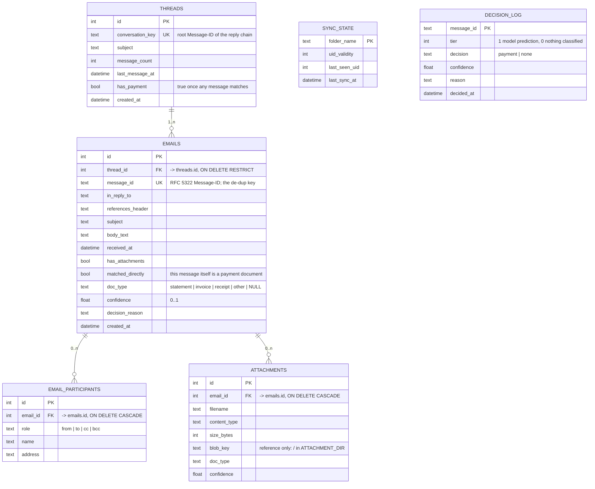

# Cache schema

Status: the six-table model below was adopted on 2026-09-30 from a design
sketch and is the live schema (`mailbox_viewer/models.py`). It replaced the
original three-table design, whose history is at the end of this file.

Database: SQLite or PostgreSQL via SQLAlchemy 2.x ORM, selected by
`DATABASE_URL`. The same models produce `DATETIME` on SQLite and `TIMESTAMP`
on PostgreSQL. `python create_schema.py --ddl postgresql|sqlite` prints the
DDL; the **Data model** page in the app renders it live.

## ERD

## Ownership

- **threads**: one row per conversation, keyed by the root Message-ID
  (first entry of `References`, else `In-Reply-To`, else the message's own
  id). A reply whose root is not cached joins the nearest cached ancestor.
  `message_count`, `last_message_at` and `has_payment` are rolled up on
  insert and recomputed by `--reclassify`.
- **emails**: one row per message. `message_id` UNIQUE is the de-dup
  guarantee; a missing header is replaced by `generated-<sha256 of raw>`.
- **email_participants**: one row per person per role, so To and Cc lists
  that change across a thread stay clean and are searchable.
- **attachments**: metadata tied to the message it arrived on. `blob_key` is
  a reference into the file store; no bytes in the database.
- **sync_state**: the bookmark, one row per folder (`IMAP_FOLDERS`). The next run asks IMAP for
  `UID last_seen_uid+1:*`. A changed `uid_validity` triggers a re-walk, and
  de-dup makes that safe.
- **decision_log**: the audit trail, one row per message, rewritten each time
  the rules run.

## How data moves on one refresh

The bookmark is read first and moved last.

| Step | Action | Reads | Writes |
|---|---|---|---|
| 1 | Refresh clicked | `sync_state` | |
| 2 | Fetch UIDs above `last_seen_uid` over IMAP | | |
| 3 | **Already judged?** If `decision_log` has the Message-ID, skip. A rescan never re-judges. | `decision_log`, `emails` | |
| 4 | **Find the thread.** A reply into a thread with `has_payment` is kept regardless of its own content. | `threads`, `emails` | |
| 5 | **Classify** with the document model | | `decision_log` |
| 6 | **Keep?** Payment document, or payment thread, or `STORE_ONLY_PAYMENT=false` (the default) → save. Otherwise drop: only the log line is written. | | |
| 7 | **Save in one transaction**: thread (found or created), email, participants, attachments. Files were written to the store just before. When a thread turns into a payment thread, its earlier mail that was dropped is backfilled from the mailbox by Message-ID. | | `threads`, `emails`, `email_participants`, `attachments`, files |
| 8 | Move the bookmark | | `sync_state` |

Streamlit reads `threads`, `emails`, `email_participants`, `attachments` and
`decision_log`. Never the mailbox.

## Classification

Classification comes only from a trained document model (LayoutLMv3);
keyword rules were removed on 2026-10-06. `mailbox_viewer/classifier.py`
produces one decision per message:

| Tier | Meaning | `decision` |
|---|---|---|
| 1 | the model labelled at least one PDF or image attachment | `payment` if the strongest label is statement, invoice or receipt and its score is at least `MODEL_MIN_CONFIDENCE`, else `none` |
| 0 | nothing classified: no model configured, no PDF or image attached, or the model failed on every file | `none` |

Each attachment stores the model's own label and score in
`attachments.doc_type` / `confidence`; the message takes the strongest one.
The reason names the model, the file, the label and the score. A model error
on one file is logged and does not stop the others or the sync.

The model sits behind a two-member interface (`name`, `predict(attachment)`),
loaded by `mailbox_viewer/document_model.py` from `MODEL_PATH`. Until the
trained LayoutLMv3 model is added, `MODEL_PATH` is empty and every message is
tier 0 with "no classification model configured".

## Attachments

Bytes live under `ATTACHMENT_DIR/<sha256>/<filename>` (default
`data/attachments/`). Content-addressed keys mean identical files are stored
once and retries are idempotent. Files are written between database
transactions, so the database write lock is never held during disk I/O. The
store refuses any key that could escape its root.

## History

- 2026-09-25: original three tables (`emails`, `attachments` with inline
  BLOBs, `sync_state`) plus an eight-way category label. Reviewed and built.
- 2026-09-25: Azure Blob Storage tried via the Azurite emulator; removed the
  same week after its default telemetry raised an endpoint-security alert.
- 2026-09-30: six-table model adopted; attachments moved to the local file
  system; categories dropped in favour of `doc_type` / tier / decision log.
- 2026-10-06: keyword rules removed; classification comes only from the
  trained document model. The app split into a backend API (FastAPI) and a
  Streamlit frontend that talks to it over HTTP.
