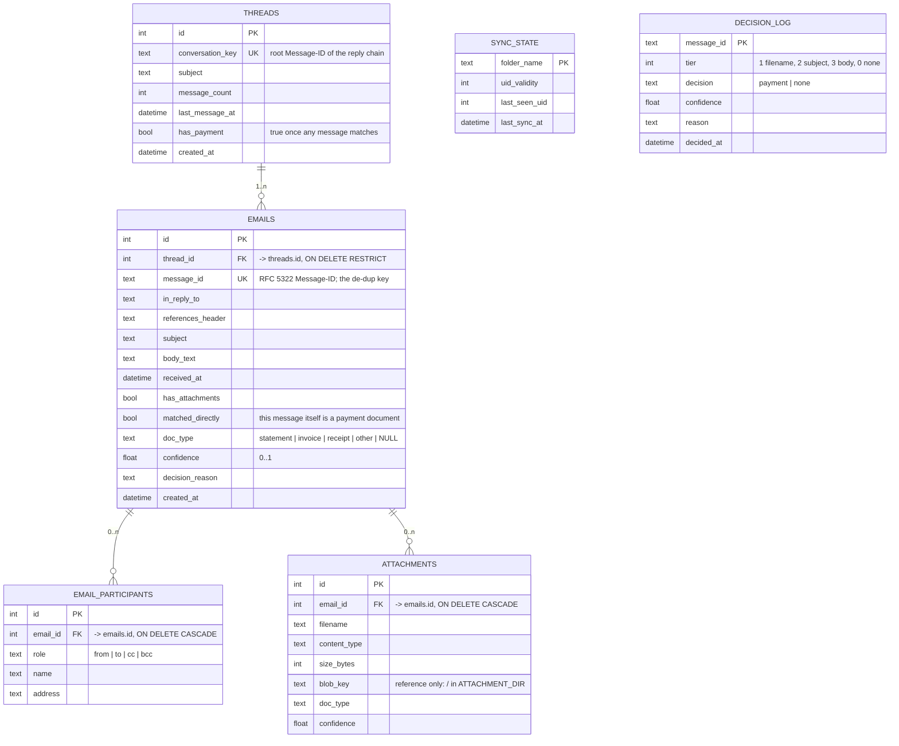

# Cache schema

Status: the six-table model below was adopted on 2026-09-30 from a design
sketch and is the live schema (`mailbox_viewer/models.py`). It replaced the
original three-table design, whose history is at the end of this file.

Database: SQLite or PostgreSQL via SQLAlchemy 2.x ORM, selected by
`DATABASE_URL`. The same models produce `DATETIME` on SQLite and `TIMESTAMP`
on PostgreSQL. `python create_schema.py --ddl postgresql|sqlite` prints the
DDL; the **Data model** page in the app renders it live.

## ERD

## Ownership

- **threads**: one row per conversation, keyed by the root Message-ID
  (first entry of `References`, else `In-Reply-To`, else the message's own
  id). A reply whose root is not cached joins the nearest cached ancestor.
  `message_count`, `last_message_at` and `has_payment` are rolled up on
  insert and recomputed by `--reclassify`.
- **emails**: one row per message. `message_id` UNIQUE is the de-dup
  guarantee; a missing header is replaced by `generated-<sha256 of raw>`.
- **email_participants**: one row per person per role, so To and Cc lists
  that change across a thread stay clean and are searchable.
- **attachments**: metadata tied to the message it arrived on. `blob_key` is
  a reference into the file store; no bytes in the database.
- **sync_state**: the bookmark. The next run asks IMAP for
  `UID last_seen_uid+1:*`. A changed `uid_validity` triggers a re-walk, and
  de-dup makes that safe.
- **decision_log**: the audit trail, one row per message, rewritten each time
  the rules run.

## Classification

`mailbox_viewer/classifier.py` produces one decision per message:

| Tier | Evidence | Confidence |
|---|---|---|
| 1 | a document attachment's filename contains a payment phrase | 0.95 |
| 2 | the subject contains a payment phrase | 0.80 |
| 3 | the first 5000 chars of the body contain a payment phrase | 0.60 |
| 0 | no phrase, or a phrase but no document attached | none (0.30 for `other`) |

A document attachment is a PDF, CSV, XLS or XLSX. Phrase families decide
`doc_type`: statement (account/bank/card/billing statement, e-statement,
statement), invoice (invoice, bill, amount due, payment due), receipt
(payment receipt, payment confirmation, receipt, transaction). Matching is on
word boundaries after folding `_`, `-` and `.` to spaces, with an optional
plural. `decision` is `payment` for tiers 1-3, else `none`. A tier-1 match
flags only the matching files; tiers 2-3 label every attached document.

## Attachments

Bytes live under `ATTACHMENT_DIR/<sha256>/<filename>` (default
`data/attachments/`). Content-addressed keys mean identical files are stored
once and retries are idempotent. Files are written between database
transactions, so the database write lock is never held during disk I/O. The
store refuses any key that could escape its root.

## History

- 2026-09-25: original three tables (`emails`, `attachments` with inline
  BLOBs, `sync_state`) plus an eight-way category label. Reviewed and built.
- 2026-09-25: Azure Blob Storage tried via the Azurite emulator; removed the
  same week after its default telemetry raised an endpoint-security alert.
- 2026-09-30: six-table model adopted; attachments moved to the local file
  system; categories dropped in favour of `doc_type` / tier / decision log.
